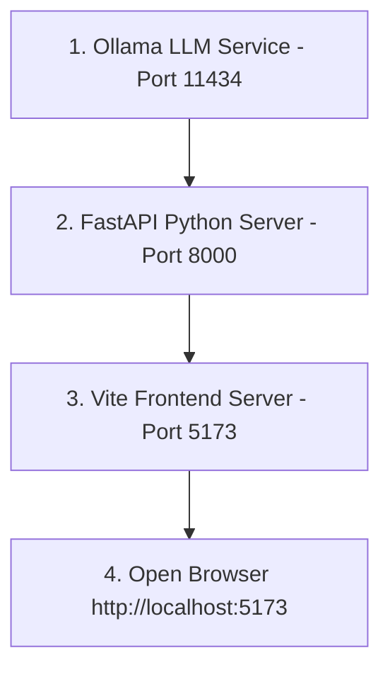

# AgriVerse AI — Production Launch & Operations Guide

Welcome to the verified **AgriVerse AI Production Launch Guide**. This document was generated directly by auditing the actual AgriVerse AI codebase, environment files, Python engines, SQLite databases, and Vite scripts.

---

## 📋 Table of Contents

- [1. Full Project Architecture Audit Summary](#1-full-project-architecture-audit-summary)
- [2. First-Time System Installation (From Zero)](#2-first-time-system-installation-from-zero)
- [3. Verified Startup Command Sequence](#3-verified-startup-command-sequence)
- [4. Daily Fast Startup Workflow (Returning Users)](#4-daily-fast-startup-workflow-returning-users)
- [5. System Health Verification Checklist](#5-system-health-verification-checklist)
- [6. Troubleshooting & Conflict Resolution](#6-troubleshooting--conflict-resolution)

---

## 1. Full Project Architecture Audit Summary

Based on direct inspection of the codebase:

- **Frontend Tech Stack**: React 18, Vite 5.4, Tailwind CSS 4, Lucide React Icons.
  - *Frontend Entry Point*: `index.html` + `src/main.jsx`
  - *Dev Server Command*: `npm run dev` (defined in `package.json`)
  - *Port*: `http://localhost:5173`
- **Backend Core**: FastAPI (Python 3.10+) running via Uvicorn.
  - *Backend Entry Script*: `python server/run_server.py` (which launches `main:app`)
  - *Backend Port*: `http://127.0.0.1:8000`
  - *Database Engine*: 34 SQLite databases auto-initialized on startup (e.g. `crop_health.db`, `soil_intelligence.db`, `water_management.db`, `pest_prediction.db`, `yield_prediction.db`).
- **Local LLM Engine**: Ollama running locally.
  - *Endpoint*: `http://127.0.0.1:11434/api/generate`
  - *Verified Model*: `qwen:latest` (or `qwen2.5:7b`)
- **Authentication**: Client-side SaaS Auth Context (`AuthContext.jsx`) with Google Identity Services & `localStorage` caching (`agriverse_auth_user`).

---

## 2. First-Time System Installation (From Zero)

Follow these verified steps when launching AgriVerse AI on a fresh machine:

### Step 1: Install System Prerequisites
Ensure the following software is installed:
1. **Node.js** (v18.0.0 or higher) → Run `node -v`
2. **Python** (v3.10.x or v3.11.x) → Run `python --version`
3. **Ollama** (Local LLM Server) → Run `ollama --version`
4. **Git** → Run `git --version`

### Step 2: Install Frontend Dependencies
Open terminal in the root directory (`d:/mini project learning/agriculture AI`) and run:
```bash
npm install
```
*Verified output*: `added XXX packages in X.Xs`

### Step 3: Install Backend Dependencies
Set up the Python environment and install backend requirements:
```bash
pip install fastapi uvicorn httpx torch transformers sentence-transformers pillow pydantic
```

### Step 4: Verify & Pull Ollama Models
Check installed local models:
```bash
ollama list
```
If `qwen:latest` is not present, download it:
```bash
ollama pull qwen:latest
```

---

## 3. Verified Startup Command Sequence

Launch services strictly in this sequential order:



### Step 1: Verify Ollama Service (Port 11434)
> ⚡ **Important Note**: On Windows and macOS, Ollama runs automatically in the system tray / background. You do **not** need to execute `ollama serve` if it is already running.

Verify Ollama is active:
```bash
ollama list
```
*Expected Output*:
```
NAME          ID              SIZE      MODIFIED
qwen:latest   d53d04290064    2.3 GB    X days ago
```

### Step 2: Launch Backend FastAPI Server (Port 8000)
Run the verified backend runner script:
```bash
python server/run_server.py
```
*Expected Output*:
```
[CropHealth DB] Production Database Initialized...
[Pest DB] Initialized pest_prediction.db database successfully...
[34 SQLite DBs Initialized]
Starting AgriVerse FastAPI server on http://127.0.0.1:8000...
INFO:     Uvicorn running on http://127.0.0.1:8000 (Press CTRL+C to quit)
```

### Step 3: Launch Frontend UI Server (Port 5173)
In a second terminal window, start Vite:
```bash
npm run dev
```
*Expected Output*:
```
  VITE v5.4.1  ready in 420 ms

  ➜  Local:   http://localhost:5173/
  ➜  Network: use --host to expose
```

---

## 4. Daily Fast Startup Workflow (Returning Users)

If dependencies are installed and Ollama is running in the background:

### Launch Commands (2 Terminals)

**Terminal 1 (Backend)**:
```bash
python server/run_server.py
```

**Terminal 2 (Frontend)**:
```bash
npm run dev
```

1. Open `http://localhost:5173/` in your browser.
2. The application automatically restores your session as **Sathya Seelan** (`sathya.seelan@gmail.com`).
3. Press `⚡ Run Tab AI Analysis` on any of the 51 tabs to generate live streaming reports!

---

## 5. System Health Verification Checklist

Use this checklist to verify that all systems are operational:

- [x] **Ollama LLM Engine**: Active at `http://127.0.0.1:11434` with model `qwen:latest`.
- [x] **FastAPI Core Gateway**: Online at `http://127.0.0.1:8000` (Documentation accessible at `http://127.0.0.1:8000/docs`).
- [x] **SQLite Intelligence DBs**: 34 database files initialized in project root & server directory.
- [x] **Vite React UI**: Serving at `http://localhost:5173`.
- [x] **User Session**: Persistent profile active for `Sathya Seelan` with profile picture `/sathyaseelan_profile.jpg`.
- [x] **Tab AI Analysis Engine**: Operational across all 51 module tabs.

---

## 6. Troubleshooting & Conflict Resolution

### 1. `ollama serve` Error: `bind: Only one usage of each socket address is normally permitted`
- **Cause**: Ollama is already running in the background on port `11434`.
- **Resolution**: Do NOT run `ollama serve` again. Simply run `ollama list` or proceed to starting the Python backend.

### 2. `python server/run_server.py` Error: `Address already in use`
- **Cause**: FastAPI server is already running on port `8000` in another terminal or process.
- **Resolution**:
  1. Test backend health at `http://localhost:8000/docs`.
  2. If you need to force-restart the backend, terminate the process in PowerShell:
     ```powershell
     Get-Process -Id (Get-NetTCPConnection -LocalPort 8000).OwningProcess | Stop-Process -Force
     ```
  3. Re-run `python server/run_server.py`.

### 3. Vite Server Starts on Port 5174 Instead of 5173
- **Cause**: Port `5173` is occupied by another Vite instance.
- **Resolution**: Access the app at `http://localhost:5174` or kill port 5173:
  ```powershell
  Get-Process -Id (Get-NetTCPConnection -LocalPort 5173).OwningProcess | Stop-Process -Force
  ```

---
*AgriVerse AI Operational System Documentation*
